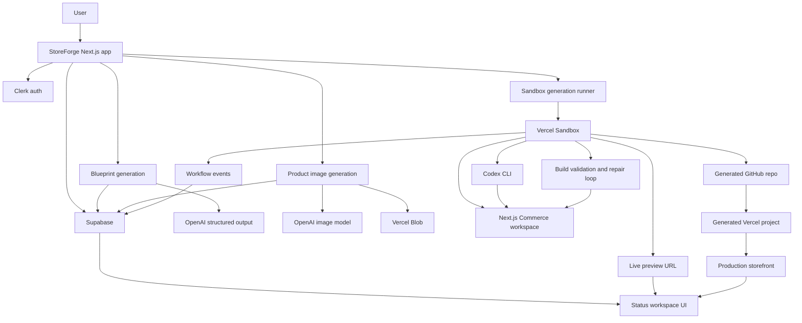

# StoreForge

StoreForge turns a store idea into a generated ecommerce storefront. It creates a brand blueprint, generates product imagery, transforms a real Next.js Commerce repository in a Vercel Sandbox, validates the build, pushes the generated code to GitHub, and deploys the result to Vercel.

The current architecture is intentionally slim: the Next.js app is the control plane, and Vercel Sandbox is the execution plane.

## What It Does

1. A user enters a store idea on `/` or `/create-store`.
2. StoreForge creates a store row and immediately redirects to `/stores/[storeId]`.
3. A brand concept is generated first so the approval page renders quickly.
4. The product catalog is generated next.
5. Product images are generated and uploaded to Vercel Blob.
6. The user approves the concept and clicks **Generate store**.
7. A Vercel Sandbox starts from the Commerce template snapshot.
8. Codex CLI transforms the Commerce repository inside the sandbox.
9. The sandbox runs build validation and up to two repair attempts.
10. The generated repository is pushed to GitHub.
11. Vercel creates/deploys the generated storefront.
12. The status page shows live preview, workflow events, GitHub repo, and production URL.

## Tech Stack

- Next.js App Router, React 19, TypeScript
- Tailwind CSS v4 and shadcn/ui
- Clerk authentication
- Supabase for stores, workflow runs, workflow events, and deployment metadata
- OpenAI Responses API for structured blueprint generation
- OpenAI image generation for product imagery
- Vercel Blob for generated product assets
- Vercel Sandbox for isolated Commerce execution and live preview
- Codex CLI inside the sandbox for repository transformation
- GitHub REST API for generated repositories
- Vercel REST API for generated projects and deployments
- Zod for runtime validation

## Architecture



## Key Modules

- `src/app` - routes, server actions, status UI, and API routes.
- `src/components` - app shell and shared UI primitives.
- `src/lib/store-generation` - blueprint generation, image generation, sandbox orchestration, workflow status mapping, publishing config, and sandbox runtime helpers.
- `src/lib/stores` - Supabase repositories for stores, workflow runs, and workflow events.
- `src/lib/blob` - Vercel Blob upload helpers.
- `src/lib/github` - GitHub repository API helpers.
- `src/lib/vercel` - Vercel project/deployment API helpers.
- `lib/store-generation/store-blueprint.ts` - shared StoreBlueprint Zod schema and deterministic fallback generator.
- `prompts/codex-transform.ts` - bounded Commerce transformation prompt.
- `scripts/create-commerce-sandbox-snapshot.ts` - prepares a reusable Commerce sandbox snapshot.
- `supabase` - schema and migrations.
- `docs/adr` - architecture decision records.

## Main Routes

- `/` - prompt-first create experience.
- `/create-store` - same store creation flow.
- `/dashboard` - latest stores for the signed-in user.
- `/stores/[storeId]` - blueprint approval, catalog review, image generation, and final generation CTA.
- `/stores/[storeId]/status` - live generation workspace with preview, timeline, logs, GitHub repo, and live store URL.
- `/api/health/check` - deployment health check.
- `/api/stores/[storeId]/workflow-status` - status polling endpoint.
- `/api/stores/[storeId]/blueprint` - blueprint data endpoint.

## Local Setup

Install dependencies:

```bash
npm install
```

Create local environment file:

```bash
cp .env.example .env.local
```

Start the app:

```bash
npm run dev
```

Open:

```text
http://localhost:3000
```

If another dev server is already using port 3000, Next.js may start on 3001.

## Required Environment

### App

```bash
NEXT_PUBLIC_APP_URL=http://localhost:3000
```

### Clerk

```bash
NEXT_PUBLIC_CLERK_PUBLISHABLE_KEY=
CLERK_SECRET_KEY=
NEXT_PUBLIC_CLERK_SIGN_IN_URL=/sign-in
NEXT_PUBLIC_CLERK_SIGN_UP_URL=/sign-up
```

If Clerk is not configured locally, the app uses the existing development user fallback.

### Supabase

```bash
NEXT_PUBLIC_SUPABASE_URL=
NEXT_PUBLIC_SUPABASE_ANON_KEY=
SUPABASE_SERVICE_ROLE_KEY=
```

Apply:

```text
supabase/schema.sql
supabase/migrations/0002_workflow_run_observability.sql
supabase/migrations/0003_workflow_events.sql
```

### OpenAI

```bash
OPENAI_API_KEY=
OPENAI_BASE_URL=
STOREFORGE_BLUEPRINT_MODEL=gpt-4o-mini
STOREFORGE_IMAGE_MODEL=gpt-image-1
STOREFORGE_IMAGE_QUALITY=low
STOREFORGE_IMAGE_SIZE=1024x1024
STOREFORGE_IMAGE_FORMAT=webp
```

Blueprint generation falls back to a deterministic local generator if no OpenAI key is configured. Image generation requires an OpenAI key.

### Codex

```bash
CODEX_API_KEY=
CODEX_MODEL=
CODEX_BASE_URL=
CODEX_CLI_PACKAGE=@openai/codex@0.130.0
CODEX_SANDBOX_MODE=danger-full-access
CODEX_BASE_COMMERCE_REPO=vercel/commerce
```

Codex runs as a CLI command inside Vercel Sandbox. The app no longer uses the Codex SDK in the production path.

### Vercel Blob

```bash
BLOB_READ_WRITE_TOKEN=
```

### Vercel Sandbox

Create a reusable Commerce snapshot:

```bash
npm run sandbox:snapshot
```

Set:

```bash
STOREFORGE_COMMERCE_REPO_URL=https://github.com/vercel/commerce.git
STOREFORGE_COMMERCE_SANDBOX_SNAPSHOT_ID=
STOREFORGE_SANDBOX_TIMEOUT_MS=2700000
STOREFORGE_SANDBOX_SNAPSHOT_EXPIRATION_MS=2592000000
STOREFORGE_LIVE_PREVIEW_ENABLED=true
STOREFORGE_LIVE_PREVIEW_PORT=3000
```

The snapshot path is preferred because it avoids recloning and reinstalling Commerce on every run.

### GitHub And Vercel Publishing

```bash
STOREFORGE_DEPLOYMENT_ENABLED=true
GITHUB_TOKEN=
STOREFORGE_GITHUB_OWNER=
STOREFORGE_GITHUB_OWNER_TYPE=user
STOREFORGE_GITHUB_REPO_VISIBILITY=private
VERCEL_TOKEN=
VERCEL_ORG_ID=
VERCEL_PROJECT_ID=
VERCEL_TEAM_ID=
```

`GITHUB_TOKEN` needs permission to create repositories and push code for `STOREFORGE_GITHUB_OWNER`.

`VERCEL_TOKEN` must belong to a Vercel account or team that can deploy repositories from that GitHub owner.

Generated repositories use:

```text
storeforge-{store-slug}-{storeId8}
```

## Vercel Project Commands

Link this app to Vercel:

```bash
vercel link
```

Pull env vars:

```bash
vercel env pull .env.local
```

Run locally:

```bash
npm run dev
```

Health check:

```text
/api/health/check
```

## Scripts

```bash
npm run dev
npm run lint
npm run test
npm run build
npm run sandbox:snapshot
```

## Tests

Unit tests run with Vitest:

```bash
npm run test
```

Current unit coverage focuses on the boundaries that matter most for this demo:

- StoreBlueprint Zod validation and deterministic fallback constraints.
- Supabase repository mapping between snake_case rows and app domain objects.
- Sandbox job configuration, publishing env parsing, and Codex prompt guardrails.

The Playwright smoke test covers the browser path from prompt entry to blueprint approval to the status shell:

```bash
npm run test:e2e
```

The smoke test is opt-in because it needs a signed-in Clerk session and writes a real store row to Supabase. Record an authenticated storage state first:

```bash
mkdir -p playwright/.auth
npx playwright codegen --save-storage=playwright/.auth/user.json http://localhost:3001/sign-in
STOREFORGE_E2E_AUTH_STATE=playwright/.auth/user.json npm run test:e2e
```

Without `STOREFORGE_E2E_AUTH_STATE`, the smoke test is skipped.

## Commerce Transformation Rules

Codex should keep the generated store close to the stable Commerce template:

- Do not rewrite checkout or cart infrastructure.
- Do not replace the Commerce data model with a separate app.
- Keep product listing and product detail pages responsive.
- Preserve the mobile menu and avoid long nav labels.
- Keep product page content well-spaced below the navigation.
- Use generated Vercel Blob image URLs for catalog products.
- Add the Blob host to Commerce `next.config` image allowlist.
- Prefer small targeted changes to branding, theme, imagery, navigation copy, homepage copy, and catalog data.
- Run build validation and use at most two repair attempts.

## Architecture Decisions

- [ADR 0001: Use Vercel Sandbox For Store Generation](docs/adr/0001-use-vercel-sandbox-for-generation.md)
- [ADR 0002: Use GitHub-Backed Vercel Deployments](docs/adr/0002-use-github-backed-vercel-deployments.md)
- [ADR 0003: Split Blueprint Generation Into Phases](docs/adr/0003-split-blueprint-generation-into-phases.md)
