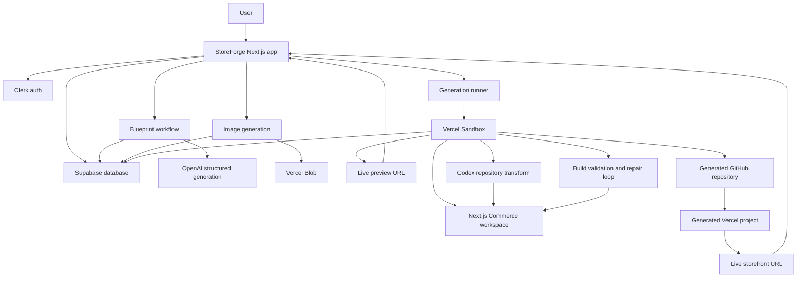

# StoreForge

StoreForge turns a business idea into a deployed ecommerce storefront using autonomous repository transformation.

The demo flow is:

1. A user describes a store.
2. StoreForge generates a structured brand concept and product catalog.
3. Product images are generated and uploaded to Vercel Blob.
4. A Vercel Sandbox runs a prepared Next.js Commerce workspace.
5. Codex transforms the Commerce repository with bounded instructions.
6. The sandbox validates the build and repairs failures.
7. The generated Commerce app is pushed to GitHub.
8. Vercel deploys the generated GitHub repository.

The product goal is reliability first: preserve the Commerce template, change branding and merchandising, and ship a real deployed storefront.

## Tech Stack

- Next.js App Router, TypeScript, React 19
- Tailwind CSS v4 and shadcn/ui
- Clerk authentication
- Supabase persistence
- Vercel Blob for generated product images
- Vercel Sandbox for isolated repository execution and live preview
- Codex SDK/CLI for repository transformation
- GitHub REST API for generated repositories
- Vercel REST API for generated deployments
- Zod for blueprint and database validation

## Architecture



## Core Modules

- `src/app` - App Router routes, server actions, status pages, and API routes.
- `src/components` - App shell and shared UI primitives.
- `src/lib/db` - Database types and Zod schemas.
- `src/lib/supabase` - Supabase browser/server client factories.
- `src/lib/blob` - Product image upload helpers.
- `src/lib/codex` - Codex SDK wrapper and event logging utilities.
- `src/lib/github` - GitHub repository creation and authenticated remote helpers.
- `src/lib/vercel` - Vercel project and deployment API helpers.
- `src/lib/store-generation` - Store blueprint generation, sandbox orchestration, workflow state, publishing config, and transformation runtime.
- `prompts` - Codex transformation prompts and Commerce safety rules.
- `supabase` - Base schema and migrations.
- `docs/adr` - Architecture decision records.
- `CONTEXT.md` - Domain language and architectural boundaries for future agents.

## User Flow

### Create A Store

`/` and `/create-store` let a user enter a store idea. Suggested prompts submit immediately.

The app creates a store row, redirects immediately, and then generates the blueprint in phases:

- Brand concept first, so the page renders quickly.
- Product catalog second, so product skeletons can resolve later.
- Product image generation as an explicit approval step.

### Approve Blueprint

`/stores/[storeId]` shows the generated brand, palette, catalog, and image prompts.

The user can regenerate product concepts, generate product images, and then generate the final store. Store generation is intended to happen after images are ready.

### Watch Generation

`/stores/[storeId]/status` shows a build workspace:

- compact generation steps
- optional activity log
- optional technical details
- live sandbox preview
- GitHub and Vercel links when available

## Environment Setup

Install dependencies:

```bash
pnpm install
```

Create local env:

```bash
cp .env.example .env.local
```

Start development:

```bash
pnpm dev
```

The app defaults to local generation unless `STOREFORGE_GENERATION_RUNTIME=sandbox` is configured.

## Required Services

### Clerk

Create a Clerk app and set:

```bash
NEXT_PUBLIC_CLERK_PUBLISHABLE_KEY=
CLERK_SECRET_KEY=
NEXT_PUBLIC_CLERK_SIGN_IN_URL=/sign-in
NEXT_PUBLIC_CLERK_SIGN_UP_URL=/sign-up
```

### Supabase

Create a Supabase project and set:

```bash
NEXT_PUBLIC_SUPABASE_URL=
NEXT_PUBLIC_SUPABASE_ANON_KEY=
SUPABASE_SERVICE_ROLE_KEY=
```

Apply the base schema and migrations:

```bash
supabase/schema.sql
supabase/migrations/0002_workflow_run_observability.sql
supabase/migrations/0003_workflow_events.sql
```

### OpenAI And Codex

Blueprint and image generation use OpenAI env vars:

```bash
OPENAI_API_KEY=
OPENAI_BASE_URL=
STOREFORGE_BLUEPRINT_MODEL=gpt-4o-mini
STOREFORGE_IMAGE_MODEL=gpt-image-1
STOREFORGE_IMAGE_QUALITY=low
STOREFORGE_IMAGE_SIZE=1024x1024
STOREFORGE_IMAGE_FORMAT=webp
```

Codex repository transformation uses:

```bash
CODEX_API_KEY=
CODEX_MODEL=
CODEX_BASE_URL=
CODEX_CLI_PACKAGE=@openai/codex@0.130.0
CODEX_SANDBOX_MODE=danger-full-access
```

### Vercel Blob

Generated product images are uploaded to Vercel Blob:

```bash
BLOB_READ_WRITE_TOKEN=
```

### Vercel Sandbox

For production-style generation, create a Commerce sandbox snapshot:

```bash
npm run sandbox:snapshot
```

Add the printed snapshot id:

```bash
STOREFORGE_GENERATION_RUNTIME=sandbox
STOREFORGE_COMMERCE_REPO_URL=https://github.com/vercel/commerce.git
STOREFORGE_COMMERCE_SANDBOX_SNAPSHOT_ID=
STOREFORGE_SANDBOX_TIMEOUT_MS=2700000
STOREFORGE_SANDBOX_SNAPSHOT_EXPIRATION_MS=2592000000
STOREFORGE_LIVE_PREVIEW_ENABLED=true
STOREFORGE_LIVE_PREVIEW_PORT=3000
```

If no snapshot is configured, the sandbox can fall back to cloning Commerce inside the sandbox.

### GitHub And Vercel Deployment

To deploy generated stores, enable deployment and provide GitHub/Vercel credentials:

```bash
STOREFORGE_DEPLOYMENT_ENABLED=true
GITHUB_TOKEN=
STOREFORGE_GITHUB_OWNER=
STOREFORGE_GITHUB_OWNER_TYPE=user
STOREFORGE_GITHUB_REPO_VISIBILITY=private
VERCEL_TOKEN=
VERCEL_TEAM_ID=
```

The GitHub token needs permission to create repositories and push code for `STOREFORGE_GITHUB_OWNER`.

The Vercel token must belong to an account or team that can access repositories under that GitHub owner through the Vercel GitHub integration.

Generated repositories are named:

```text
storeforge-{store-slug}-{storeId8}
```

## Vercel Project Setup

Link this checkout to Vercel:

```bash
vercel link
```

Pull Vercel env vars locally:

```bash
vercel env pull .env.local
```

Run locally:

```bash
pnpm dev
```

Health check:

```text
/api/health/check
```

## Useful Scripts

```bash
npm run lint
npm run build
npm run codex:spike
npm run commerce:spike
npm run sandbox:snapshot
```

`codex:spike` proves Codex can edit a small filesystem workspace.

`commerce:spike` proves Codex can transform the Commerce template and run validation.

`sandbox:snapshot` prepares a reusable Commerce snapshot for faster sandbox generation.

## Repository Transformation Rules

Codex must preserve the base Commerce app:

- Do not rewrite checkout or cart infrastructure.
- Do not replace the Commerce data model with a new app architecture.
- Keep product pages and product listing pages responsive and well-spaced.
- Use generated Blob image URLs in the Commerce catalog and allow the Blob host in `next.config`.
- Prefer small, targeted changes to branding, theme, imagery, navigation copy, and catalog data.
- Run build validation and use at most two repair attempts.

## Architecture Decisions

- [ADR 0001: Use Vercel Sandbox For Store Generation](docs/adr/0001-use-vercel-sandbox-for-generation.md)
- [ADR 0002: Use GitHub-Backed Vercel Deployments](docs/adr/0002-use-github-backed-vercel-deployments.md)
- [ADR 0003: Split Blueprint Generation Into Phases](docs/adr/0003-split-blueprint-generation-into-phases.md)
